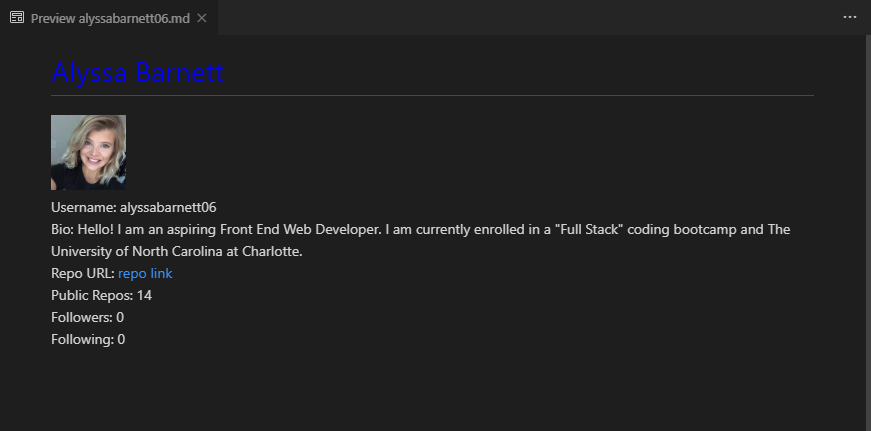

# profileGenerator

The user will be prompted for a favorite color, which will be used as the color of users name.
The  MarkDown will be populated with the following:

-Profile image

-User name

-Link to User GitHub profile

-location

-User bio

-Number of public repositories

-Number of followers

-Number of users following

